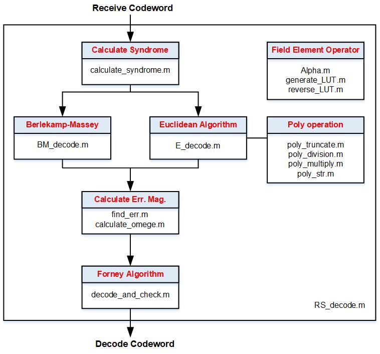

# Reed-Solomon Decoder

## Overview
This code implements the Berlelamp-Massey and Euclidean algorithm for decoding Reed-Solomon Code. The file structure is as follows: 
 

## Usage
1. Run "RS_decode.m" on MATLAB
2. The result will be print on the screen and also saved to "result.txt"