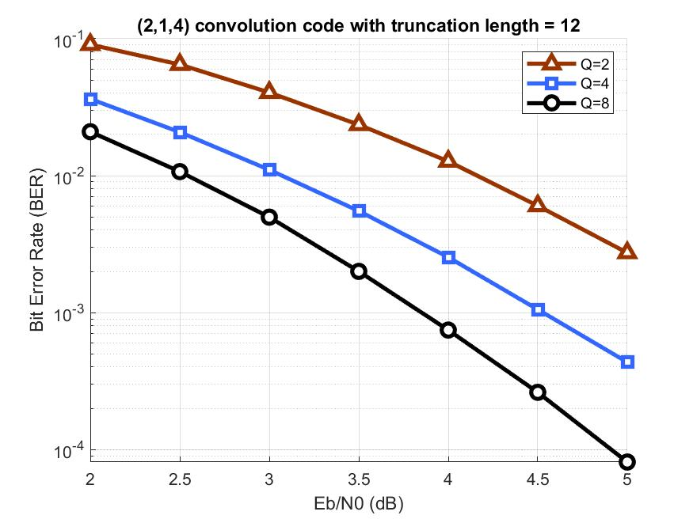

# Viterbi Decoder

## Overview
This code implements the Viterbi decoding with trunction and quantization techniques
 
## Usage
1. Run "Viterbi_decode.m" on MATLAB
2. The result BER-EbN0 plot will be saved in 'jpg' format and the BER values are saved to "result.txt"