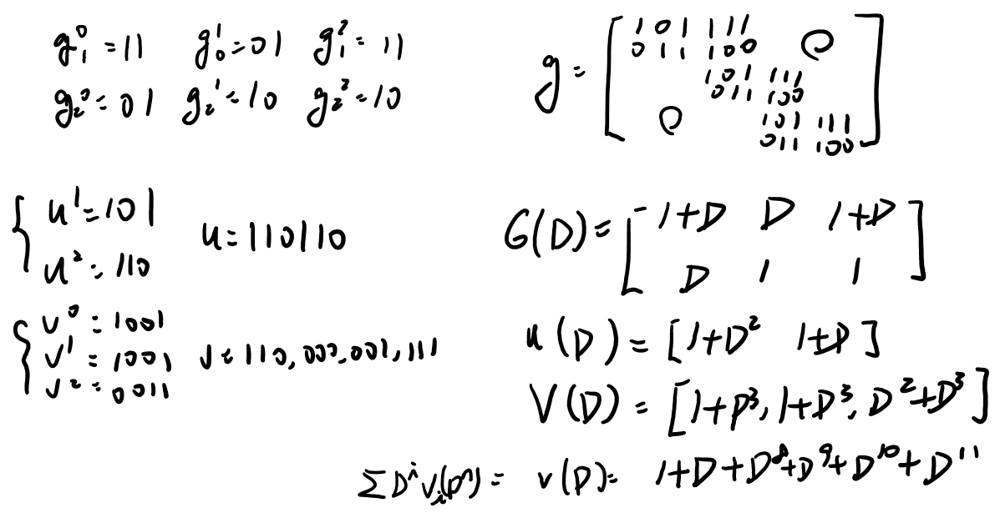
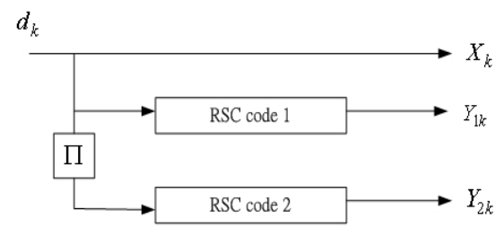
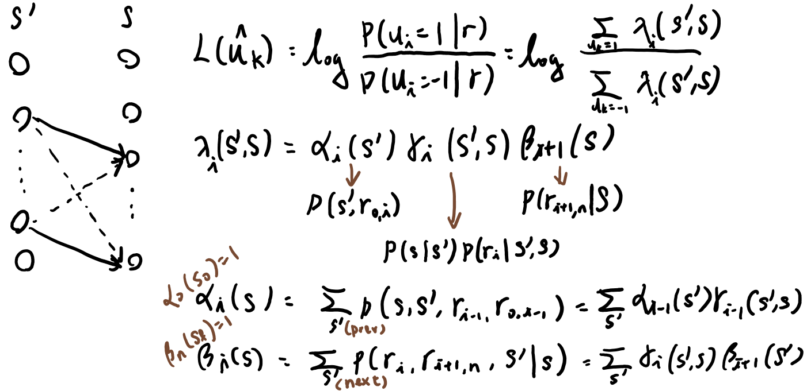
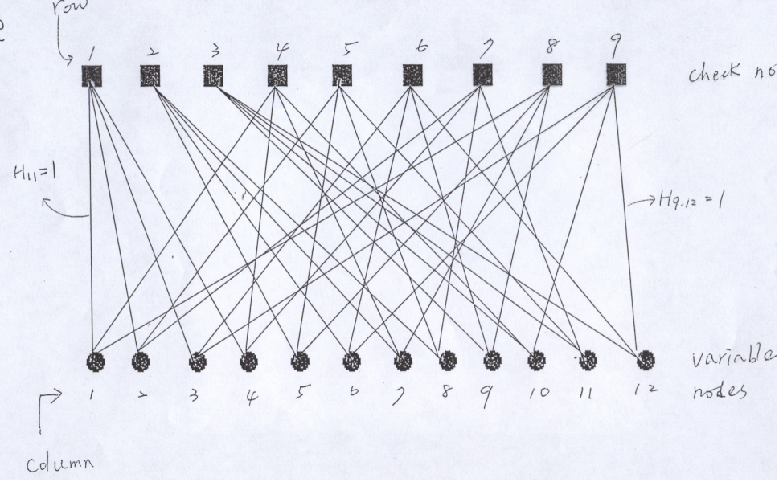

## Chapter 7. Convolutional Codes
* **[Definition]** A $(n,k,m)$ convonlutional code takes $k$-bit input and generates $n$-bit output, which depends on current input and inputs with memory order $m$. The impulse response can be characterize as $g_k^n$.
* The mamimum number of encode bits that can be affect by a single information bit is $n(m+1)$, where $m=\max(K_i)$
* The associated code rate is $R=\frac{kL}{n(L+m)}$ if the info. seq. is termiated with all-zero blocks.
* **[Transfomation Domain Representation]** 
 

* **[State Diagram]** There are $2^K$ states, where $K=\sum(K_i)$ is the total numbre of encode bits.
* **[WEF]**
$T(X)=\sum_{i}A_{i}X^i$
* **[IOWEF]** 
$T(X,Y,Z)=\sum_{i,j,l}A_{i,j,l}X^iY^jZ^l$ where $i,j$ is the weight of the code bits and the message bits, and $l$ is the branch length.
* **[Def. (Free distance)]** $d_{free}=\min(d(v',v''):u'\neq{}u'')=\min(w(v'+v''):u'\neq{}u'')=\min(w(v):v\neq{}0,v\in{C})=\min(w(uG):u\neq{}0)$
* **[Systematic Convolutional Code]**
$G=\begin{bmatrix}
I_k & P_0 & 0 & P_1 & 0 & P_2\\
 &  & I_k & P_0 & 0 & P_1 & \dots\\
 & & & & I_k & P_0\\
 & & & & \vdots\\
\end{bmatrix}$
The associated transfer function matitrx is:
$G(D)=\begin{bmatrix}
1 & 0 & 0 & 0 & g_1^{k+1}(D) & \dots & g_1^{n}(D)\\
0 & 1 & 0 & 0 & g_2^{k+1}(D) & \dots & g_2^{n}(D) \\
 & \vdots{}&  & \vdots{}& \vdots &  & \vdots\\
0 & 0&\dots{} & 1 & g_k^{k+1}(D) & \dots & g_k^{n}(D)\\
\end{bmatrix}$
* **[Feedforward Inverse]** $G(D)G^{-1}(D)=I_kD^l$ for some $l\geq{0}$. For a $(n,k,m)$-code a feedforward inverse of delay $l$ exists iff $GCD[\Delta_i(D)]=D^l$, where $\Delta_i(D)$ be the determinants of the $k\times{}k$ submatrices of $G(D)$.
* **[Ex 7.4]** For $g^1=1+D$ and $g^2=1+D^2$, since $GCD([1+d,1+D^2])=1+D$, the inverse does not exists.
* **[Def 7.2 (Catastrophic code)]** Is a convolutional code for which infinite-weight info. seq. produces a finite weight codeword. (For instance, a $u(D)=\frac{1}{1+D}=1+D+D^2+\dots$ and the self-loop around a state with zero code weight and nonzero information weight)
* **[Prop ]** A code is non-catastrophic iff inverse exists; namely.
* **[Prop ]** A systematic code is always non-catastrophic.
* **[Gerneral Generator Form]** A more genral form of the generator transfer function is 
$G_{i,j}(D)=\frac{P_0+P_1D+\dots{}}{1+q_1D+\dots{}}$
* **[Parity Check Matrix]** If $V(D)H^T(D)=0$ for all $V(D)$ then $H(D)$ is the parity check matrix. Also, we have $G(D)H^T(D)=0$
* **[Ex. (Parity Check Matrix)]**
Given $G(D)=\begin{bmatrix}
D & D^2 & 1 \\
0 & 1 & D \\
\end{bmatrix}$
By elimination, we have
$\begin{bmatrix}
D & D^2 & 1 \\
0 & \frac{1}{D} & 1 \\
\end{bmatrix}
\rightarrow
\begin{bmatrix}
D & D^2+\frac{1}{D} & 0 \\
0 & \frac{1}{D} & 1 \\
\end{bmatrix}
\rightarrow
\begin{bmatrix}
\frac{D^2}{D^3+1} & 1 & 0 \\
0 & \frac{1}{D} & 1 \\
\end{bmatrix}
\rightarrow
\begin{bmatrix}
\frac{D^2}{D^3+1} & 1 & 0 \\
\frac{D}{D^3+1} & 0 & 1 \\
\end{bmatrix}
$
Therefore, 
$H(D)=\begin{bmatrix}
1 & \frac{D^2}{D^3+1} & \frac{D}{D^3+1} \\
\end{bmatrix}
$
* **[Ex 7.6 (Log-Likelihood of BSC and AWGN)]** 
    * For a BSC where $P(r|v)$ is $(1-p)$ for $P(0|0)$ & $P(0|0)$, and $p$ for $P(0|1)$ & $P(1|0)$. $\log{}P(r|v)=d(r,v)\log\frac{p}{1-p}+N\log{(1-p)}$
    * For a AWGN channel where $P(r|v)$ is $\log{}\frac{1}{\sqrt{2\pi\sigma^2}}-\frac{1}{2\sigma^2}(r-v)^2$. $\log{}P(r|v)=N\log{}\frac{1}{\sqrt{2\pi\sigma^2}}-\frac{1}{2\sigma^2}(r-v)^2$
    * MLD in BSC = Min Hamming distance 
    * MLD in AWGN = Min ED2 distance = Max correlation
* **[Performance Bound]**
 

* **[Viterbi Algorithm]**
* **[Soft Decoding]**
    * For transmitting $c_i$ and receiving $r_i=\pm\sqrt{E_s}+w_i$
    * For MLD, $\min(d^2(r,c))=\max(\sum_ir_ic_i)$
Also, $\sum_ir_ic_i=\sum_i|r_i|-2\sum_{i,r_ic_i<0}|r_i|$ $\rightarrow$ $\min(\sum_{i,r_ic_i<0}|r_i|)$ (correlation discrepency)
    * If $d$ code bits are different between an incorrect and a correct path, the probablity of occurence is $P_d=P[z<0>]$ where $z=\sum_ir_i$ has mean $d\sqrt{E_s}$ and variance $\frac{dN_0}{2}$
    * $P_d=Q(\sqrt{\frac{2dE_s}{N_0}})$
    * The BER $P_b(E)=\frac{1}{k}\sum_{d_{free}}^{\infty}B_dQ(\sqrt{\frac{2dE_s}{N_0}})\approx\frac{1}{2k}\sum_{d_{free}}^{\infty}B_de^{-d\frac{E_s}{N_0}}\approx\frac{1}{2k}B_{d_{free}}e^{-d_{free}\frac{E_s}{N_0}}$
    * There is a 3dB gain compared with hard decision
* **[Pratical Considerations]**
    * Quantiaziton Levels $Q$
    * Truncation length $\tau$
    * Survivor storing: Trace-back method and path exchange method

## Chapter 9. Turbo Codes
* **[NSC and RSC]** Non-systematic Convolutional Code (NSC) can be converted into recursive sytematic code (RSC) without changing its distance property
* **[Turbo Encoder]**
 

* **[Reduction of Error Coefficients]**
    * In RSC, weight-1 messages will generate an infinite-weight sequence, hence the weight of $m_i$ is more than 1
    * After interleaving, the more than 1 nonzero bits in $m_i$ will likely be seperated $\rightarrow$ $P'(m_i)$ will likely have large weights
    * Error coefficient $\frac{N}{M}$ where $N$ is the number of nearesr neighbors
    * Using larger interleaver size can achieve lower error coefficient
    * Lower error coefficient will result in lower error rate
*  **[Def. (LLR)]** 
    * $L_U(u)=\log{}\frac{P_U(u=+1)}{P_U(u=-1)}$
    * For BSC, $L(x|y)=L_cy+L(x)$ where $L_c=\log{}\frac{1-\epsilon}{\epsilon}$ and $L(x)=\log{}\frac{P(x=+1)}{P(x=-1)}$
    * For AWGN, $L(x|y)=L_cy+L(x)$ where $L_c=\frac{4E_s}{N_0}$
    * Supposed $x$ is trasmit twice, then $L(x|y_1,y_2)=L_cy_1+L_cy_2+L(x)$
* **[Soft-in-Soft-out Decoder]**
For a systematic code, $L(\hat{u})=L_cy+L(u)+L_e(\hat{u})$ (a posteriori for info bits = channel valus for all code bits + a priori for info bits + extrinsic for info bits) (see exmaple in page 22)
* **[Min-Sum Algorithm]** 
    * For $u_1,u_2$ in GF2 and $u=u_1\oplus{}u_2$ (0,1$\rightarrow{}$1,-1)
    * Define $L_U(u)=\log{}\frac{P_U(u=+1)}{P_U(u=-1)}$, then the soft bits $\lambda{}(u)$ is $E[u]=P(u=+1)-P(u=-1)=\tanh(\frac{L(u)}{2})$
    * $L(u)=2\tanh^{-1}(\tanh(\frac{L_1(u)}{2})\tanh(\frac{L_2(u)}{2}))\approx\text{sgn}(L(u_1))\text{sgn}(L(u_2))min(|L(u_1)|,|L(u_2)|)\doteq{L(u_1)\boxplus{}L(u_2)}$
    * With correction term $L(u_1)\boxplus{}L(u_2)=\text{sgn}(L(u_1))\text{sgn}(L(u_2))min(|L(u_1)|,|L(u_2)|)-s(|L(u_1)|,|L(u_2)|)$ where $s(x,y)=\ln\frac{1+e^{|x-y|}}{1+e^{|x+y|}}$
    * **[Min-Sum-c]** the value $c=0.5$ is used for the correction
* **[Iterative Decoding]**
    1. $i=1,L(u)=0$
    2. Calculate $L^{-}(\hat{u})$ & $L_e^{-}(\hat{u})=L^{-}(\hat{u})-[L_cy+L(u)]$
    3. Calculate $L^{|}(\hat{u})$ & $L_e^{|}(\hat{u})=L^{|}(\hat{u})-[L_cy+L_e^{-}(\hat{u})]$
    4. if $i=I$ stop, else go to 2. & $L(u)=L_e^{|}(\hat{u})$
    5. $L(\hat{u})=L_cy+L_e^{|}(\hat{u})+L_e^{-}(\hat{u})$
* **[Maximum a Posteriori (MAP) for Systematic Convolutional Code]**
 

* **[Log-MAP]**
$L(\hat{u}_k)=L_cy_{k_1}+L(u_k)+\max_{u_k=1}\log[\gamma^{(e)}_k(s',s)\alpha_{k-1}(s')\beta(s)]-\max_{u_k=-1}\log[\gamma^{(e)}_k(s',s)\alpha_{k-1}(s')\beta(s)]$
* **[Soft-in-Soft-out Viterbi Algorithm (SOVA)]**

* **[Serial Concatenated Turbo Code]**
* **[EXIT Chart Analysis for Iterative Decoding]**
    * For $z=x+n$ where $n\sim(0,N_0)$ LLR of $z$ is $Z=\frac{4}{N_0}z=\frac{4}{N_0}(x+n)=\mu_Zx+n_Z$ where $n_Z\sim(0,2\mu_Z)$ which is consistent gaussian
    * Pinch-off region: the region of low EbN0
    * Bottleneck region: decoding trajectory just mamanging to sneak through the narrow tunnel
    * Wide-open resion: the BER floor region

## Chapter 10. LDPC Codes
* **[Def 10.1]**
A $(t,s)$-regular LDPC code with parity check matrix:
    * All column has weight $t$
    * All row has weight $s$
    * $nt=rs$ and $R=1-\frac{r}{n}=1-\frac{t}{s}$
* **[Tanner Graph]**
 

* **[Encoding]**
$H^T=\begin{bmatrix} A_1 \\ A_2 \end{bmatrix}$ and $G=[A_2A_1^{-1}|I_k]$

* **[Minimum Distance of LDPC]**
* **[Message Passing Decoding]**

* **[Irregular LDPC]**
    * Let $m,n,E$ be the number of check nodes, var nodes and edges
    * The degree distribution for variable node is $\lambda(X)=\sum_{i=1}^{d_v}\lambda_iX^{i-1}$ where $\lambda_i$ is the fraction of all edges connected to the variable node
    * The degree distribution for check node is $\rho(X)=\sum_{i=1}^{d_c}\rho_iX^{i-1}$ where $\rho_i$ is the fraction of all edges connected to the check node
    * Number of var node with degree $i$: $N_v(i)=\frac{E\lambda_i}{i}$
    * Number of check node with degree $i$: $N_c(i)=\frac{E\rho_i}{i}$
    * $\int_0^1\lambda(X)dX=\sum\frac{\lambda_i}{i}=\frac{n}{E}$
    * $\tilde{\lambda}(X)=\sum_{i=1}^{d_v}\tilde{\lambda_i}X^{i-1}$ where $\tilde{\lambda_i}$ is the fraction of var node with degree $i$.
    * $\tilde{\lambda_i}=\frac{N_v(i)}{n}=\frac{\lambda_i}{i\int_0^1\lambda(X)dX}$
* **[Progressive Edge Growth (PEG) Construction]**
* **[ACE Algorithm]**
* **[EXIT of LDPC]**
* **[Quantized Density Evolution (QDE)]**
* A Gaussian random variable is consistent if its variance is equal to twice its mean.

## Chapter 11. Polar Codes
